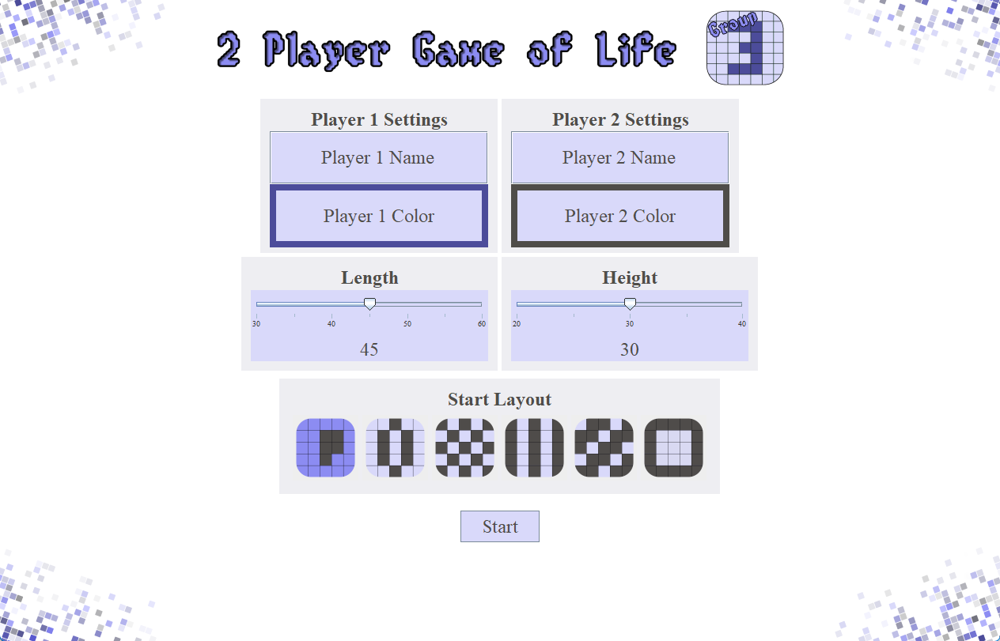
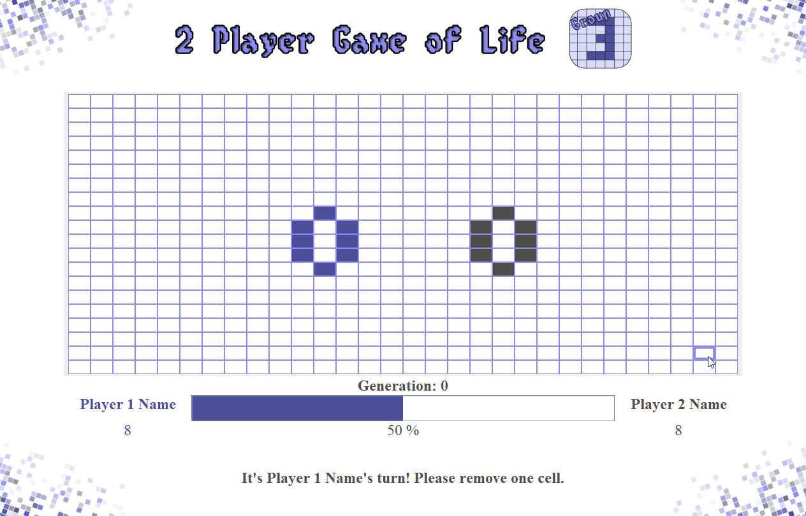

# Multiplayer_Conway_Game_of_life

### Objective
This a 2 player version of conway game of life. Each player has their own cells, these are represented by their color.
The name, color and starting template are defined at the beginning of the game.

On a player’s turn, he or she must remove one enemy cell and add a cell of their own. Afterwards the board is evolved.

### Evolution Rules
- **existing cells** survive if they have 2 or 3 neighboring cells
- **new cells** can be created if they have exactly 3 neighboring cells --> the cell takes on the color of the majority of its neighbors

#### Before Evolution

#### After Evolution

